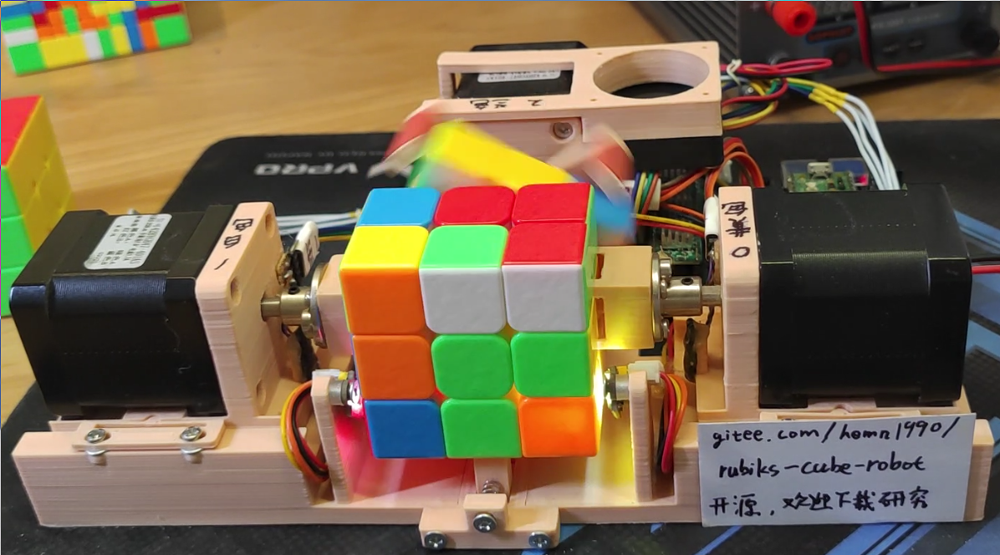

# 三阶魔方还原机器人

## 介绍
低成本魔方机器人设计。 含原理图、PCB、单片机源码（c语言）、结构图（openSCAD格式/STL格式）、主要器件BOM。 使用rp2040单片机控制，控制和魔方求解都使用单片机完成。 对于随机打乱的魔方，平均还原步骤数在21步左右。**扫描+计算+还原总时间在5.2秒左右。**  
2024-04-14主要更新内容：  
优化NAND FLASH刷写.刷写工具另开新仓库存放:  
https://gitee.com/hemn1990/uf2-nand-flash-prog  
以前的NAND FLASH刷写方式依旧可以使用.  
推荐使用新方式刷写NAND FLASH.  
新方式刷写时间更短,操作更简单.  

2024-03-28主要更新内容：  
优化求解魔方的程序,计算耗时减少1.5%.  
使用cube_robot.c里的debug_solve()测试  
STEP_LIMIT=23 P2_STEP_LIMIT_MAX=11 测试50个随机打乱的魔方，耗时8982ms  

2024-01-16主要更新内容：  
1.解决魔方安装错误时，容易死机的问题。  
2.修复使用还原功能后，立即使用自动测试功能，无法正确打乱魔方的问题。  
3.更新性能测试数据。  

2024-01-14主要更新内容：  
1.提升稳定性，可通过30轮的打乱+还原循环测试。测试30组不同的、使用CubeExplorer5.0的WCA打乱公式打乱的魔方，平均还原时间在5.2秒左右。作为对比，v2.0的平均还原时间在7.6秒左右。  
2.增加魔方打乱功能。  
3.增加打乱+还原自动测试功能  
4.移除无用还原动作。  
5.修改慢动作逻辑，操作方式改为短按SW4正常还原，长按SW4慢动作还原。  

2024-01-13主要更新内容：  
1.使用FIFO+PIO控制步进电机，支持三个电机以各自独立的速度曲线同时运动。  
2.改成只使用RP2040的一个核心，代码更容易被理解。  
3.提升I2C频率，顺便修复I2C1没有停止位的BUG。  
4.增加编译好的MCU固件cube_robot.uf2。  
5.优化还原速度，对每个动作设置各自独立的速度和加速度。  
6.优化还原速度，优化运动控制逻辑，支持同时执行某些动作，  

V2.0版本更新内容：  
1.提供原理图和PCB。  
2.解决滑台卡扣寿命短、容易断裂或者松动的问题，改为磁力固定。  
3.支持使用手机或者电脑的Type-C充电器供电。  
4.解决魔方夹持结构在长时间使用后容易松动、以及异常条件下可能断裂的问题。  
5.优化霍尔开关安装方式，简化安装步骤。  
6.解决棘轮结构噪声特别大的问题。  
7.提供详尽的装配教程，适合新手看的那种。  
8.完善物料清单。  
9.补充性能测试数据。  

后续更新计划：  
1.优化魔方还原算法。  



V1.0版本演示视频：video/VID_20220618_165444.mp4  
V1.1版本（21步版本）的演示视频：http://www.bilibili.com/video/BV1Qt4y1476Y?share_medium=android&share_source=copy_link&bbid=XYF29BCF6DF22C72C26DED32037959465ED97&ts=1657889031274  
V2.0版本的演示视频：https://b23.tv/s6q7KzU  
装配与调试教程：  
（1）控制板调试 https://b23.tv/Xj93aZk  
（2）魔方的选购 https://b23.tv/2x8Be0n  
（3）机械部分的组装 https://b23.tv/huJY1xt  
（4）整机调试 https://b23.tv/o8LBCXT  
（5）软件更新，10分钟搞定FLASH刷写 https://b23.tv/LJm5dEw  


## 关于硬件设计
2023-12-25更新：新增原理图与PCB设计文件  
2022-07-07更新：SPEPPER_EN修改为GP2，添加SPI NAND FLASH 型号W25N01GVZEIG  
2022-07-10更新：按键由GP0,GP1改为GP27,GP28)只修改了./src_21_step  

将RP2040单片机的GPIO，任意连接到步进电机驱动器、颜色传感器、霍尔传感器即可。除了SPI、UART，其他引脚只用了GPIO，未使用其他复用功能。  
霍尔传感器只能5V供电，RP2040单片机IO是3.3V，注意电平转换设计。  
FLASH是可选的，如果不使用FLASH，平均还原步骤数在32步左右。  
参考GPIO分配方式如下：  

#### 步进电机使能信号
- SPEPPER_EN    GP2
#### 步进电机控制信号
- SPEPPER_STEP0 GP11
- SPEPPER_DIR0  GP10
- SPEPPER_STEP1 GP9
- SPEPPER_DIR1  GP8
- SPEPPER_STEP2 GP7
- SPEPPER_DIR2  GP6
#### 霍尔开关，用于寻找零点
- HALL_0        GP5
- HALL_1        GP3
- HALL_2        GP4
#### 按键
- BUTTON_0      GP27
- BUTTON_1      GP28
#### 颜色传感器信号
- SDA0          GP14
- SCL0          GP15
- SDA1          GP12
- SCL1          GP13`
#### SPI NAND FLASH信号
- CS(1)         GP17
- DO(2)         GP16
- DI(5)         GP19
- CLK(6)        GP18


## 关于结构设计
1、推荐使用**ABS材料**3D打印，喷嘴0.4mm，层高0.2mm，顶层5层、底层5层、外壳4圈、填充20%-40%，生成支撑。  


## 单片机固件编译(./src_21_step,平均还原步骤数在21步左右的版本)
推荐使用Linux系统进行开发，可按照RP2040官方文档中的脚本搭建开发环境。  
完成后，可额外安装pypy3，用于计算查找表。（此步骤可省略，提供生成好的）  
Windows也行，不过我没验证过。  

**生成查找表**，并且进行验证（可选步骤,prog_flash目录下提供生成好的）

运行完成后，得到lookup.dat,文件大小大约70MB
````
cd ./src_21_step/verify_on_pc
pypy3 prun.py
make
./solve
````

**编译单片机固件**
````
cd ./src_21_step/mcu
mkdir build
cd build
export PICO_SDK_PATH=xxxxxxxx
cmake ..
make
````
然后找到cube_robot.uf2，刷写到RP2040单片机即可。

可以连接USB，使用minicom -D /dev/ttyACM0指令查看调试信息，例如：
````
color_detect: URUFUBDDUFRRFRDDFURLLLFUDLLLUBRDLRBFLDBDLBFFFBUBRBBRUD
Find 21 step solution in 139ms: B F' D' L' B F R B' U2 R B U2 B2 R2 U F2 D' B2 L2 U F2 
Totel time cost 7.772s: 
color_detect: UFFFURURRBDRRRDDLFBUDBFFBDFLBLLDBUBDFURLLRBUDUDLLBFRUL
Find 19 step solution in 95ms: F L2 B' R' L2 B L' B' F' D B2 D F2 D U B2 F2 L2 B2 
Totel time cost 7.575s: 

````
**刷写SPI NAND FLASH**

连接电脑和RP2040的串口，注意线一定要短，波特率高达1Mbps。   

按住BUTTON_0的同时给魔方机器人上电，程序会计算NAND FLASH的CRC32校验和，如果失败，自动进入刷写模式   
***注意烧写串口和USB虚拟串口不是同一个,不是同一个,不是同一个,重要的事情要说三遍.***   

````
cd ./src_21_step/prog_flash
make
./prog /dev/ttyS0 # /dev/ttyS0改为电脑的串口号

````
运行prog的电脑终端出现如下调试信息，说明刷写成功。
````
mcu in SPI FLASH programming mode
Check lookup.dat CRC32 = A8093698
0, size=131072
Erase Block 0
Program Block 0 ................................................................
Verify Block CRC32 0................................................................
此处省略若干行...
Erase Block 565
Program Block 565 ................................................................
Verify Block CRC32 565................................................................

````

## 单片机固件编译(./src,平均还原步骤数在32步左右的版本，硬件上不需要外挂1Gbit FLASH)
*此版本不再维护，慎用*  
推荐使用Linux系统进行开发，可按照官方文档中的脚本搭建开发环境。  
Windows也行，不过我没验证过。  

搭建好之后
````
cd src
mkdir build
cd build
export PICO_SDK_PATH=xxxxxxxx
cmake ..
make
````
然后找到cube_robot.uf2，刷写到RP2040单片机即可。

可以连接USB，使用minicom -D /dev/ttyACM0指令查看调试信息，例如：
````
color_detect: FLDFUUUDBDLRURRFDLBFRDFBFLRDDURDBBUBLURBLRLBLFFUFBLDRU
stage=0, D' B U' L F' 
stage=1, B2 R2 U2 F2 D R' L' U L' 
stage=2, R2 D' F2 D2 R2 D R2 D' B2 D' 
stage=3, B2 R2 U2 B2 U2 L2 U2 L2 F2 R2 B2 
````


